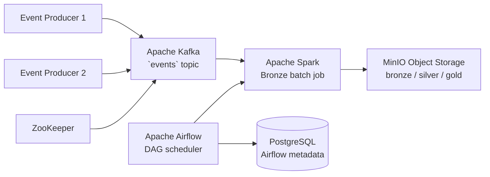

# Data Platform & Financial Analytics Pipeline


A local, Docker-based data platform demonstrating an end-to-end lakehouse workflow: synthetic events are generated, published to Kafka, processed by scheduled Spark jobs orchestrated with Airflow, and stored in MinIO as partitioned Parquet data.

The repository also contains an independent financial analytics and machine learning module covering historical market analysis, XGBoost modelling, evaluation, SHAP explainability, and investment-strategy simulations.

> Developed as a final-year project for learning, experimentation, and portfolio demonstration. It is not intended for production deployment or financial advice.

## Architecture



### Data flow

1. Two Python producers generate synthetic user events every second.
2. Events are published as JSON messages to the Kafka `events` topic.
3. Airflow schedules the `lakehouse_pipeline` DAG using the `WINDOW` setting.
4. Spark parses the messages, filters the configured time window, and adds calendar partitions.
5. The Bronze dataset is appended to MinIO in Parquet format under `s3a://bronze/eventos_batch`.

## Technology stack

| Component | Purpose |
| --- | --- |
| Docker Compose | Reproducible local infrastructure |
| Apache Airflow | Workflow orchestration and scheduling |
| Apache Kafka | Event streaming and buffering |
| Apache Spark | Batch data processing |
| MinIO | S3-compatible object storage |
| PostgreSQL | Airflow metadata database |
| ZooKeeper | Kafka coordination for this local setup |
| Python | Producers, utilities, and financial analytics |
| XGBoost and SHAP | Modelling and explainability |

## Repository structure

```text
airflow/dags/             Airflow DAG definitions
docker/                   Dockerfiles and Compose configuration
kafka/                    Synthetic Kafka event producer
models/                   Financial analysis and machine learning scripts
spark/                    Spark jobs and Spark configuration
sql/                     MinIO initialization utilities
.env.example              Required environment variables
```

## Current scope

The Bronze layer is implemented. The Silver and Gold Spark files are currently scaffolding for future transformations.

Included:

- Docker Compose environment for the complete local platform.
- Airflow DAG for scheduling and submitting Spark jobs.
- Kafka producers and topic initialization.
- Spark master, workers, and a Kafka-to-MinIO Bronze job.
- MinIO buckets for `bronze`, `silver`, and `gold`.
- Independent financial modelling and evaluation scripts.

## Prerequisites

- Docker Desktop with Docker Compose v2.
- At least 8 GB of RAM allocated to Docker is recommended.
- Python 3.10+ for running standalone financial scripts outside the containers.

## Quick start

Create the environment file:

```bash
cp .env.example .env
```

On Windows PowerShell:

```powershell
Copy-Item .env.example .env
```

Review `.env`. The Compose configuration expects MinIO credentials, an Airflow username, and a scheduling window:

```dotenv
MINIO_ROOT_USER=minioadmin
MINIO_ROOT_PASSWORD=change-me
AIRFLOW_USERNAME=admin
WINDOW=5
```

Start the platform from the repository root:

```bash
docker compose -f docker/docker-compose.yml --env-file .env up --build
```

To run it in the background:

```bash
docker compose -f docker/docker-compose.yml --env-file .env up -d --build
```

## Local service endpoints

| Service | URL or address | Purpose |
| --- | --- | --- |
| Airflow | http://localhost:8081 | Workflow UI |
| Spark Master UI | http://localhost:8080 | Cluster and job status |
| MinIO API | http://localhost:9000 | S3-compatible endpoint |
| MinIO Console | http://localhost:9001 | Object storage UI |
| Kafka | `localhost:9092` | Local broker endpoint |

Use the credentials configured in `.env`.

## Useful commands

```bash
# Check running services
docker compose -f docker/docker-compose.yml ps

# Follow all logs
docker compose -f docker/docker-compose.yml logs -f

# Follow a specific service
docker compose -f docker/docker-compose.yml logs -f airflow

# Stop containers without removing data volumes
docker compose -f docker/docker-compose.yml stop

# Stop and remove containers and networks
docker compose -f docker/docker-compose.yml down

# Open a shell inside a running container
docker compose -f docker/docker-compose.yml exec airflow bash
```

Avoid `docker compose down -v` unless you intentionally want to delete local database and storage volumes.

## Key implementation details

### Airflow DAG

[`airflow/dags/lakehouse_pipeline.py`](airflow/dags/lakehouse_pipeline.py) defines the `lakehouse_pipeline` DAG and submits the Bronze Spark job with Kafka, MinIO, and time-window configuration.

### Kafka producer

[`kafka/kafka_producer.py`](kafka/kafka_producer.py) publishes JSON events to the `events` topic:

```json
{
  "user_id": 12,
  "product": "A",
  "price": 45.60,
  "timestamp": 1710000000.0
}
```

### Spark Bronze job

[`spark/spark_bronze.py`](spark/spark_bronze.py):

- Reads Kafka messages in batch mode.
- Parses the JSON payload into a typed Spark schema.
- Filters events by the Airflow-provided time window.
- Adds `year`, `month`, `day`, and `hour` partitions.
- Writes append-only Parquet data to `s3a://bronze/eventos_batch`.

### Financial analytics

The scripts in [`models/`](models/) are independent from the streaming pipeline. They cover historical data acquisition, time-aware classification/regression workflows, calibration and risk metrics, SHAP explanations, and DCA/value-averaging simulations.

## Development roadmap

- Implement Silver transformations for cleaning, validation, and deduplication.
- Add Gold aggregates and analytics-ready tables.
- Add data quality checks and automated tests.
- Add observability for pipeline runs and data freshness.
- Replace the local ZooKeeper-based Kafka setup with a production-ready coordination approach.
- Add dependency lockfiles for the financial analytics environment.

## Notes and limitations

- This is a local development environment; change default credentials before any shared or exposed deployment.
- MinIO uses HTTP inside the Docker network.
- Kafka runs as a single broker with replication factor one.
- Financial models are research artefacts, not investment recommendations.

## License

No license has been specified yet. Add one before distributing or reusing this project publicly.
